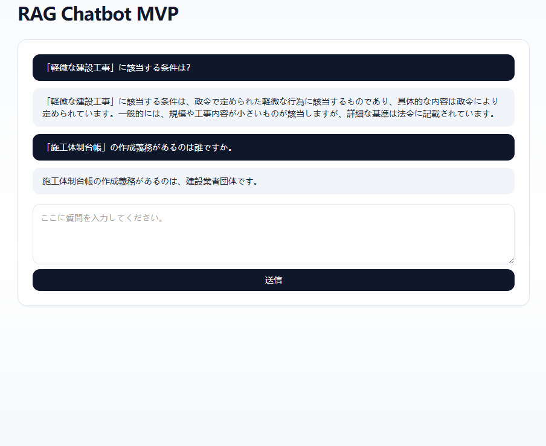
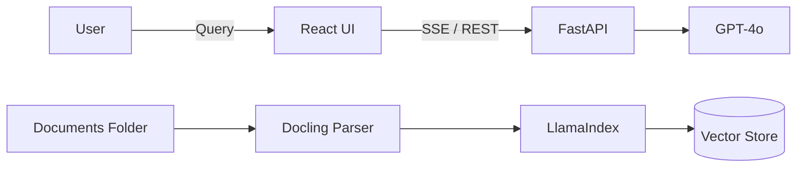

# RAG-Chatbot

## 概要
本プロジェクトは、専門領域の文書（PDF/Excel/Docs）を対象にした高精度RAG基盤です。  
Docling によるレイアウト解析と、BGE 系モデルによる検索精度の最大化を前提に設計しています。

## デモ (Demo)

## 主な機能
- **高度な文書解析**: Docling により見出し階層・段落構造を保持。
- **ハイブリッド検索**: セマンティック検索とキーワード検索の統合。
- **ストリーミング回答**: FastAPI + SSE によるリアルタイム応答。

## 技術選定理由
- FastAPI: 非同期処理とストリーミングに強く、拡張が容易です。
- LlamaIndex: 文書ロードからクエリエンジンまでのRAG基盤を迅速に構築できます。
- Docling: レイアウト解析に強く、文書構造保持に有利です。
- BGE-M3: 多言語・多用途の埋め込みが可能で、専門用語に強い傾向があります。
- BGE-Reranker: ハルシネーション抑制のために上位文書を再評価します。
- GPT-4o: 高精度な回答生成と広い知識域を持ちます。

## システム構成図

## 前提条件
- Python 3.10 以上（GPU 利用時は Python 3.12 を推奨）
- Node.js 18 以上
- OpenAI または OpenRouter の API Key（`OPENAI_API_BASE` を切り替え可能。OpenAI は `https://api.openai.com/v1`、OpenRouter は `https://openrouter.ai/api/v1`）

## 環境変数
`.env` に設定します。実際の値は `.env`、共有用は `.env.example` を参照してください。

| 変数名 | 説明 | 例 | 必須 |
| --- | --- | --- | --- |
| OPENAI_API_KEY | OpenRouter API Key | `sk-or-v1-...` | 必須 |
| OPENAI_API_BASE | OpenRouter エンドポイント | `https://openrouter.ai/api/v1` | 必須 |
| LLM_MODEL | 生成モデル名 | `gpt-4o-mini` | 必須 |
| EMBED_MODEL | 埋め込みモデル | `BAAI/bge-m3` | 必須 |
| EMBED_DEVICE | 埋め込み推論デバイス | `cuda` / `cpu` | 任意 |
| DOCLING_DEVICE | Docling の推論デバイス | `cuda` / `cpu` | 任意 |
| DOCLING_OCR | OCR を有効化 | `true` / `false` | 任意 |
| DOCLING_TABLES | 表解析を有効化 | `true` / `false` | 任意 |
| DOCLING_PICTURES | 画像抽出を有効化 | `true` / `false` | 任意 |
| DOCLING_CHUNK_BY_HEADERS | 見出し階層で分割 | `true` / `false` | 任意 |
| HF_ENDPOINT | HuggingFace ミラー | `https://hf-mirror.com` | 任意 |
| HF_HUB_HTTP_TIMEOUT | モデルDLのタイムアウト | `60` | 任意 |
| REBUILD_INDEX | 起動時に再索引 | `true` / `false` | 任意 |

## 導入手順
1. 依存関係のインストール
   - Python 依存: `pip install -r requirements.txt`  
   - フロント: `cd frontend && npm install`
2. 環境変数の設定
   - `.env` に必要項目を設定
3. 起動
   - バックエンド: `uvicorn app.main:app --reload`
   - フロント: `npm run dev`

## 使い方
1. PDF を `app/data/documents/` に配置します。
2. バックエンド起動時に自動で解析・索引が作成されます。
3. フロントエンドを開き、質問を入力するとストリーミング回答が返ります。
