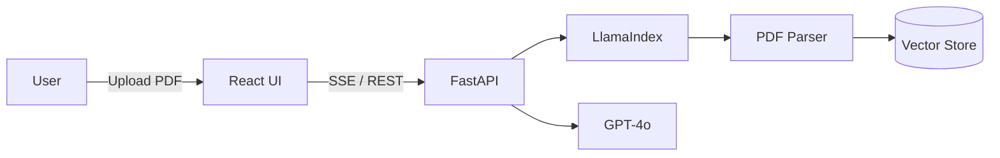

# RAG-Chatbot (Step 1 MVP)

## 概要
本プロジェクトは、専門領域の文書（PDF/Excel/Docs）を対象にした高精度RAG（Retrieval-Augmented Generation）システムを構築するための基盤です。MVPではPDFをアップロードし、ストリーミングで回答を返す最短経路を用意します。

## 設計思想
1. 検索優先（Retrieval > Generation）
   - 根拠がない回答は返さず、「不明」と判断できる設計を重視します。
2. レイアウト理解
   - Doclingにより文書構造（見出し階層・表・段落）を保持し、表記ゆれや文脈の取りこぼしを抑制します。
3. 多段検索
   - Excel FAQは高精度の文字列一致を優先し、PDFは意味検索＋再ランキングで精度を担保します。

## 技術選定理由
- FastAPI: 非同期処理とストリーミングに強く、拡張が容易です。
- LlamaIndex: 文書ロードからクエリエンジンまでのRAG基盤を迅速に構築できます。
- Docling: レイアウト解析に強く、表や段落構造の保持に有利です。
- BGE-M3: 多言語・多用途の埋め込みが可能で、専門用語にも強い傾向があります。
- BGE-Reranker: ハルシネーション抑制のために上位文書を再評価します。
- GPT-4o: 高精度な回答生成と広い知識域を持ちます。

## システム構成図

## 導入手順
1. 依存関係のインストール（例）
   - `pip install fastapi uvicorn llama-index openai aiofiles`
2. 環境変数の設定
   - `OPENAI_API_KEY` を設定してください。
3. 起動
   - `uvicorn app.main:app --reload`
4. フロントエンド
   - `npm install`
   - `npm run dev`

## 使い方（MVP）
1. PDFをアップロードします。
2. 質問を入力すると、検索結果に基づいてストリーミングで回答します。

## 今後の展望
- Docling統合によるレイアウト保持の強化。
- Excelの精密一致レイヤーとFAQベクトル層の二段構成。
- Hybrid Search（BM25 + Vector）とBGE-Reranker統合。
- RAGASでの評価パイプライン構築（Faithfulness/Relevance/Correctness）。
- Semantic Cacheと非同期タスクキューによる高速化。
- Sub-Question Query Engineによる複合質問対応。
